# 🌅🌌 Solar Dynamic Wallpaper

## Generate your own prettier version of macOS's "Solar Gradients" dynamic wallpaper.

macOS comes with a dynamic wallpaper called [Solar Gradients](https://www.jetsoncreative.com/24-hour-wallpaper-ios/gradient-ios) that changes throughout the day, displaying a sky color based on the sun's position.

I love the idea, but not so much the execution. Its daytime blue is far too saturated to resemble a realistic sky, and the sunrise and sunset colors lack the diverse spectrum of hues that make for a picturesque vista. Personally, I'd also like to see some stars at night – on my computer display at least, if not outside in my artificial light-soaked city sky.

This project generates a dynamic solar wallpaper that attempts to rectify these perceived shortcomings. And if you don't like my color choices, you can customize it with your own!

See the [**Screenshots**](#screenshots) section for how it looks by default.

## Installation

### Prerequisites

- A semi-recent version of macOS that supports dynamic wallpapers
- [Homebrew](https://brew.sh/) installed
- [Node.js and npm](https://docs.npmjs.com/downloading-and-installing-node-js-and-npm) installed. Check the [`package.json`](package.json) "engines" config entry for the versions I used.

### Setup

Just run `npm install`. This will install dependencies and run a script which installs [mczachurski/wallpapper](https://github.com/mczachurski/wallpapper), the application which will compile the gradients into a dynamic wallpaper file.

## Usage

```bash
npm run generate-wallpaper -- --project=[PROJECT_NAME]
```

⚠️ Important: Make sure you don't forget to include the `--` before the `--project` flag in the command above!

Replace `[PROJECT_NAME]` with one of:

- `macbook-air-13`
- `macbook-pro-14`
- `macbook-pro-16`

This will spin up a Playwright-controlled browser which takes screenshots for various times of day and uses [wallpapper](https://github.com/mczachurski/wallpapper) to assemble them into an `output.heic` file in the `images/` directory. To set this gradient as your wallpaper on macOS:

1. Change your wallpaper to the **built-in** "Solar Gradients" wallpaper.
2. Right click the `output.heic` file and choose "Set Desktop Picture".

## Development

If you want to inspect and modify the gradients yourself, run:

```bash
npm start
```

This will start a local server where you can view and edit the gradient. In a browser developer tools console, you can run
`setAnimPct([pct])`, where `[pct]` is a number 0-100. This will set the gradient animation to a point in time, where 0 and 100 are nighttime and 50 is midday, and pause it there.

You can edit the gradients in the [`app.css`](app.css) and tweak aspects of the animation and star generation in [`app.js`](app.js).

You can change the supported screen resolutions for the wallpaper generation in [`playwright.config.ts`](playwright.config.ts).

You can change how many gradients are generated and from which points of the animation in [`screenshot.spec.ts`](screenshot.spec.ts).

Few random notes:

- We take screenshots with Safari becuase it's the only major browser that performs gradient [dithering](https://en.wikipedia.org/wiki/Dither). This (largely) prevents the [banding](https://en.wikipedia.org/wiki/Colour_banding) which other browsers will exhibit.
- You probably want the wallpaper resolution to exactly match your screen resolution. This is because the stars are drawn to be exactly one pixel, making them a bright point of light. They will look more blurry if the resolutions differ by even a pixel.
- If you're unsatisfied with the subtle banding that can still appear in the final product, you can further dither the screenshots in image editing tools like Photoshop or GIMP. Just note that this requires handling the stars as a separate layer.
- I'm using the OKLCH color space for [gradient interpolation](https://developer.mozilla.org/en-US/docs/Web/CSS/color-interpolation-method) because I find it results in a wider (and generally more realistic) range of hues – especially around sunrise and sunset – without adding a ton of color stops. However, it does result in some non-contiguous, weird-looking behavior at certain points in the animation. You can use the OKLAB color space to fix the non-contiguousness; the colors are just a bit more muted.

## Screenshots

Below are the wallpaper stops generated for a 13-inch MacBook Air without modifications. You can find them in the [`images/`](images/) folder. Using this repo, you can generate wallpaper for different-resolution displays and customize them to your liking.

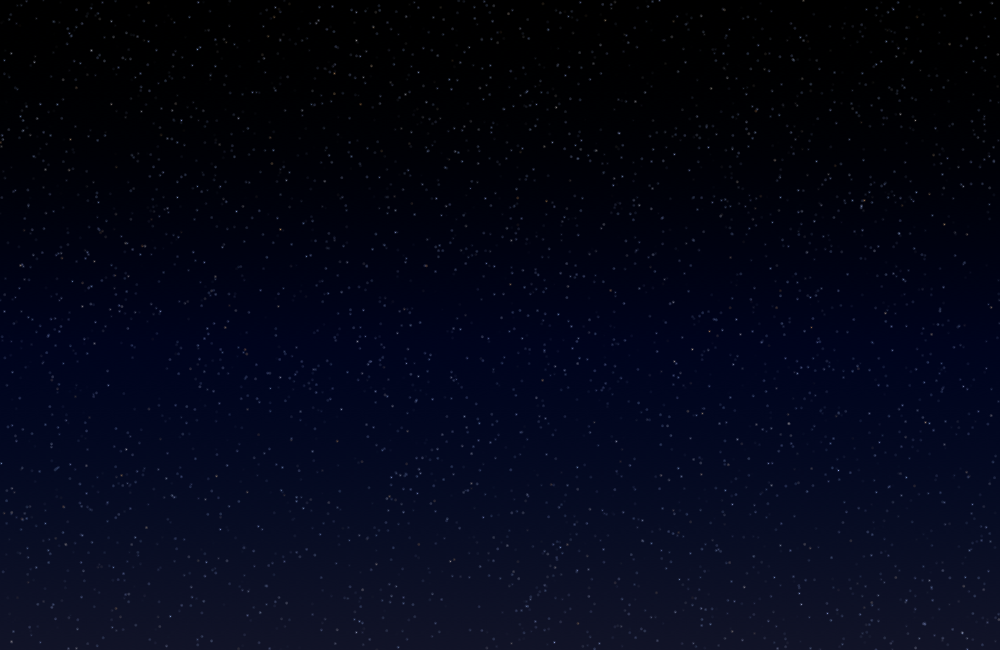
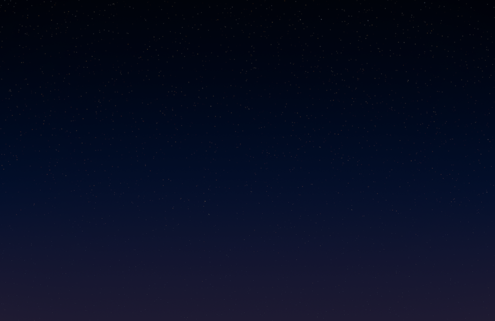
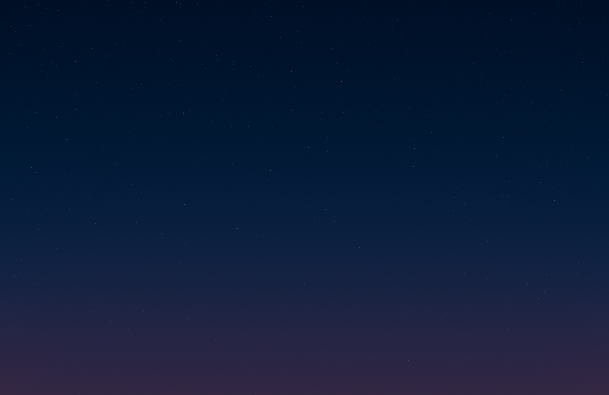
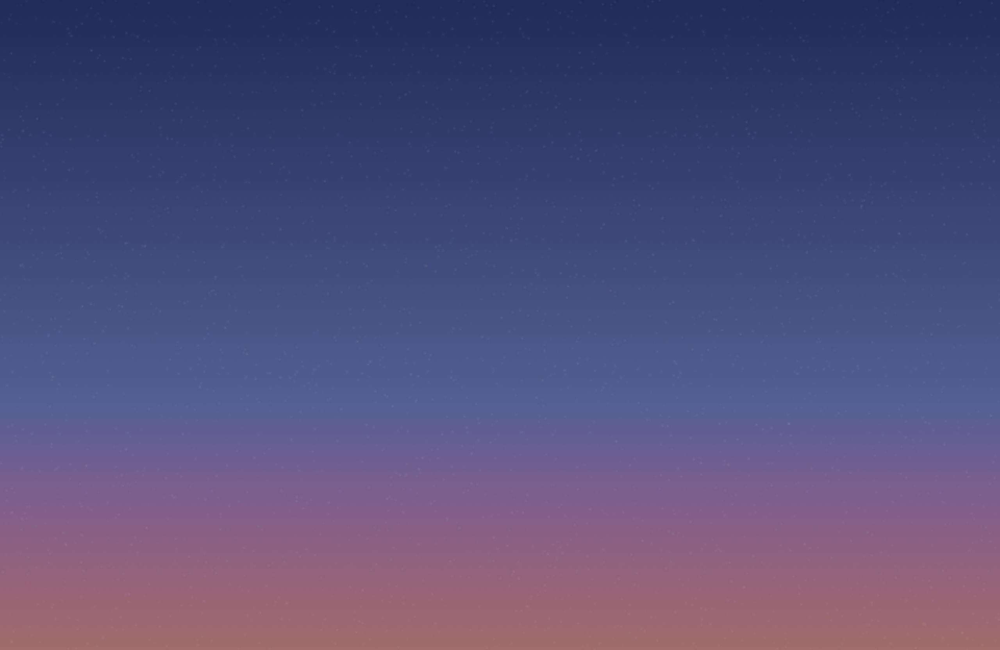
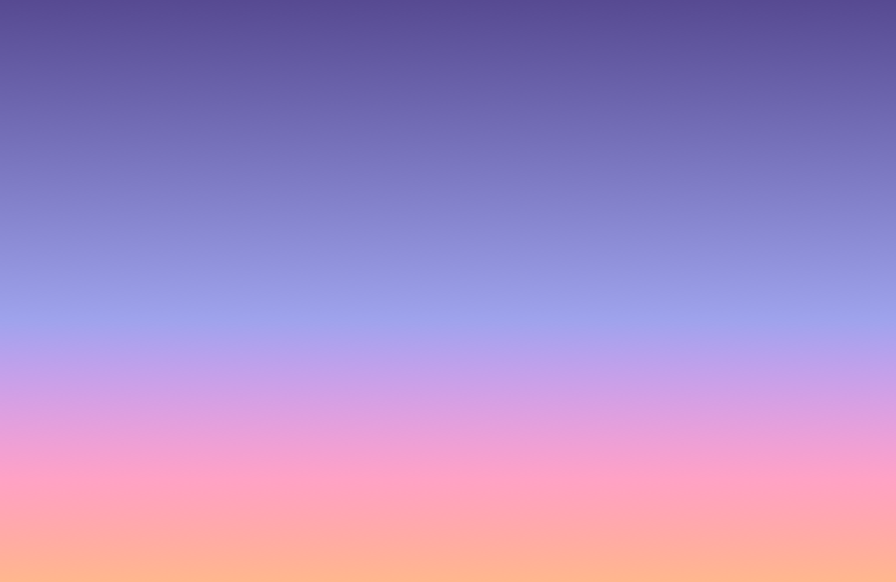
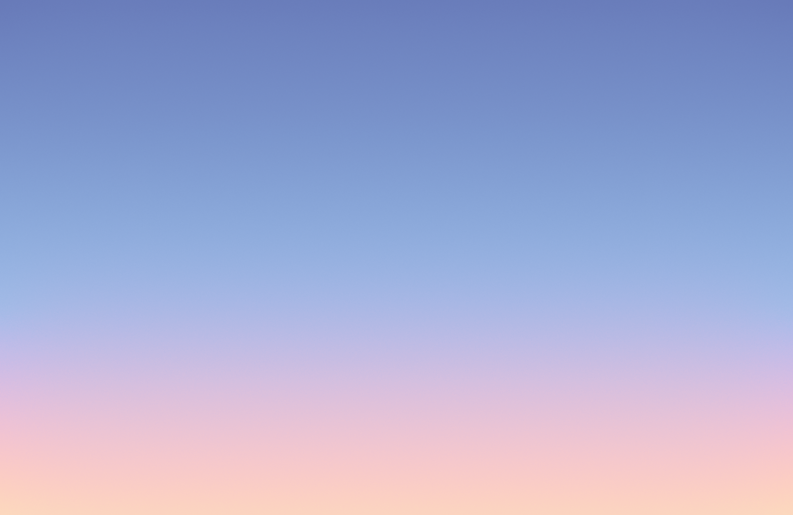


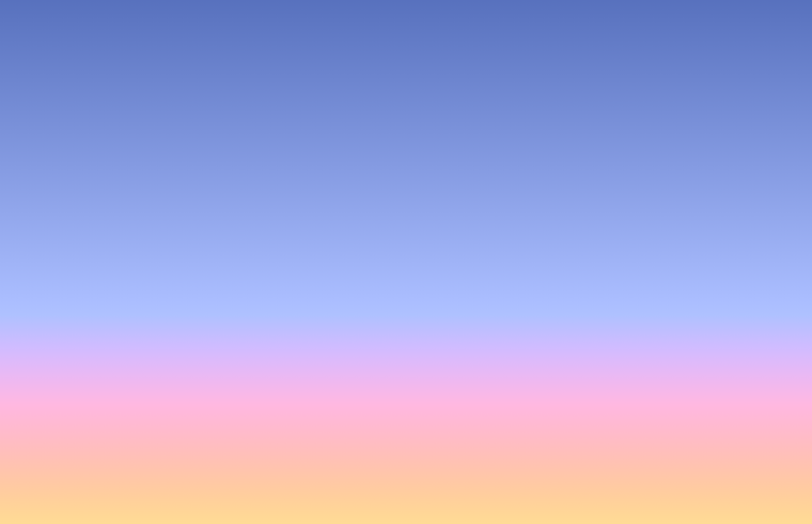
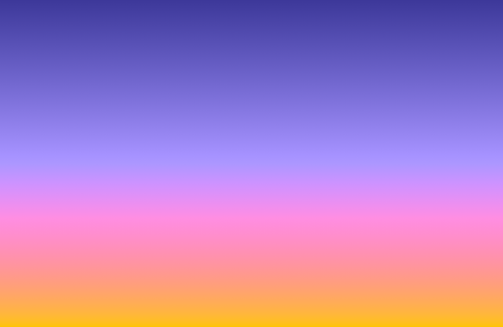
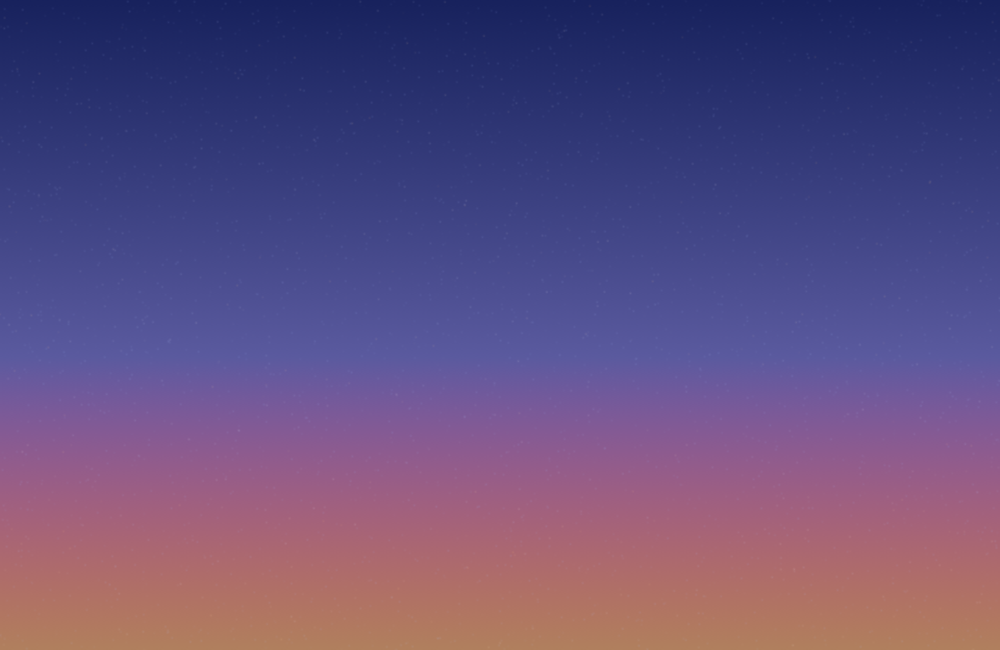
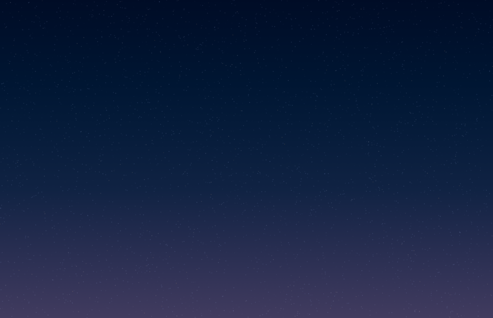
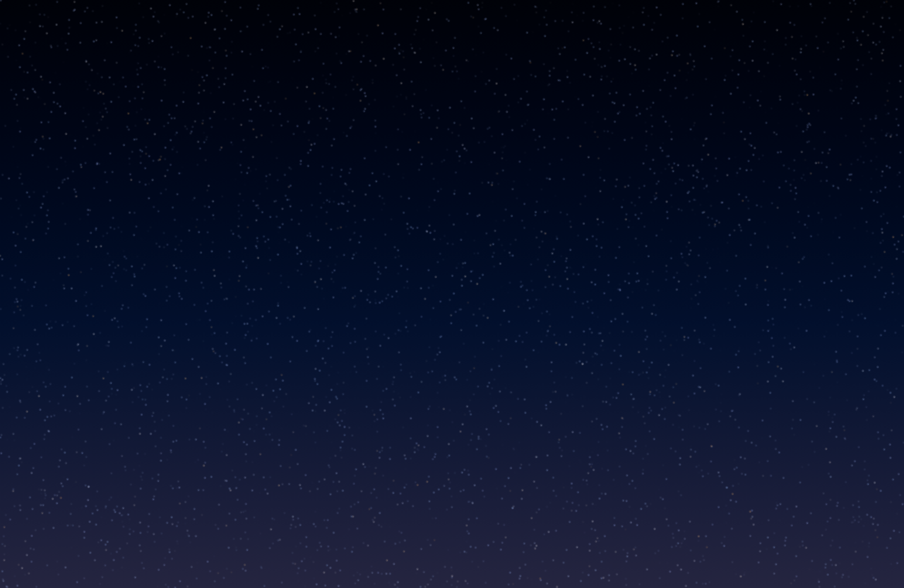

